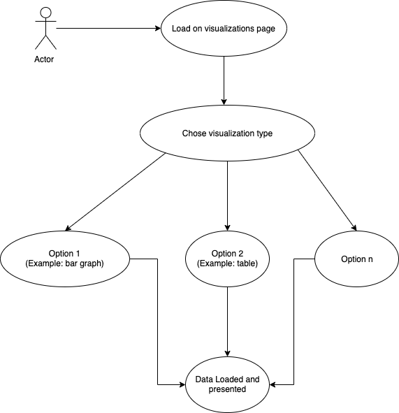

  Assignment 8 - Individual Software Requirements
   
  Chris Rehagen
   
  CS4230
  
   

## Introduction
The purpose of this tool will be to create a dependable way of measuring the health, sustainability and stability of a given project. Through clear and understandable metrics, users will be given insight into the viabilty of open source software projects so they can best assess it uses.

## Software Project Overview
The purpose of this project will be to provide the accurate and reliable metrics for developers and their managers so they can make the best decisions about whether or not to use code from that given repository. It will be hosted from an online web service so that it can best be available to a wide variety of users. These metrics are useful on their own but will be most powerful then used to compare projects to determine the best one

## System Use
The system is intended to be used by users exploring utilizing a given open source project. With the system, they'll be able to make more confident decisions about which projects they should utilize.  

The best way this will be accomplished is through pulling data about each project and organzing that data into a format that can be input into a graph, table or other visualization so that the data can be easily interpreted. 

## System Requirements

#### Use Cases
#### Use Case 1: Loading data
  

#### Use Case 2: Choice how the data is presented:

#### Functional
  - Have visually appealing and easy to naviagte UI
  - Make API calls to retreive data
  - Provide visualizations of given statistics/metrics
  - Error check if there is not relevant/valid data

#### Non-Functional
  - Documentation available to users
  - Fast (API calls aren't slow/delayed)
  - General reliability
  
## Design Constraints
  1. Specific data types needed for each metric
  2. Web friendly (responsive design, works in all browsers, etc.)
  3. Interface provides data representations in graphical and optional plain text form
  4. Hosted online so no need for additional installations or downloads for the users (all you need is the URL and you're set)
  5. Loading bar/cirlce on the screen during API calls/page loads so the user knows the app is working and isn't frozen

## Purchased Components
The main item(s) that would need to be purchased is a domain and a web-hosting server to run the app
  
## Interfaces
  As mentioned previously, the user interface for this application will be crucial to its success and usability.  
  
  Ideally, there would be a tab bar at the top of the screen showing all the options that can be displayed, examples of which can be "Repo Groups," "Individiaul Repositories," "Top Health," "About this App," etc. A search function should also be included.  
  
  Next, there'd be the individual representations of the desired data. Above this, though, will be an option to choose how the data is dislayed (graphically, plain-text data, top-to-worst order, etc). Then below, and depending on the option selected, the data/visualations will be displayed.
