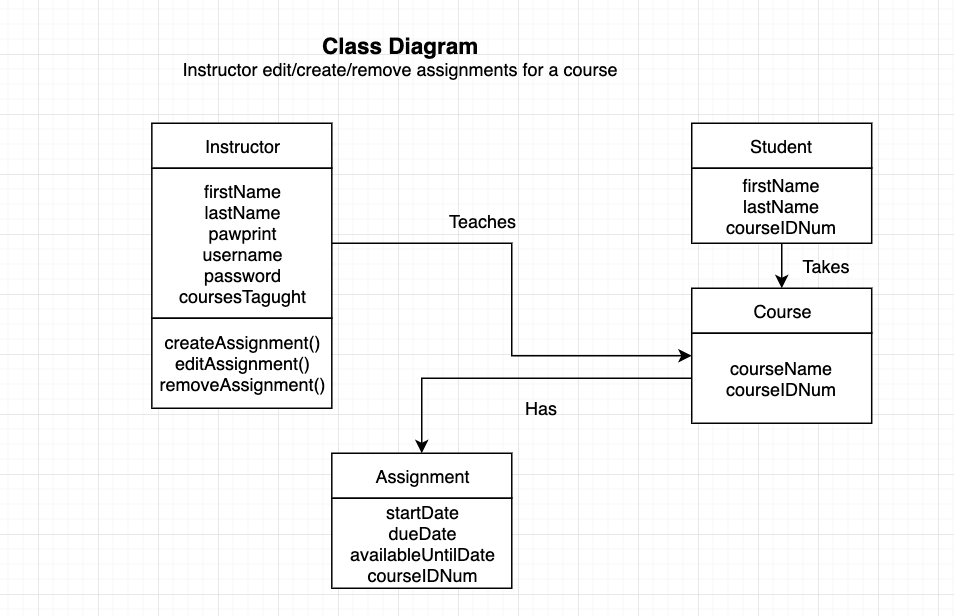

# Table of Contents

## Activity Diagrams

**File Name: InstructorActivityDiagram.png**  
  
Created by: Chris Rehagen  
Peer Reviewed by: Tim Helfant  

**File Name: LoginActivitydiagram.bmp**
  
Created by: Tim Helfant  
Peer Reviewed by: Chris Rehagen  

**File Name: StudentSubmissionActivityDiagram.jpg**   
  
Created by: Sarah Brooks  
Peer Reviewed by: Chris Rehagen & Tim Helfant 

## Class Diagram  

**File Name: classDiagram.png** 

Created by: Chris Rehagen  
Peer Reviewed by Tim Helfant  

## State Machine Diagram  

**File Name: stateMachineDiagram.png** 
  
Created by: Chris Rehagen  
Peer Reviewed by Tim Helfant  

## Use Case Diagram  

**File Name: useCaseDiagram.png** 
    
Created by: Chris Rehagen  
Peer Reviewed by Tim Helfant  

## Sequence Diagram
**File Name: LoginSequencediagram.jpg** 
  
Created by: Tim Helfant  
Peer Reviewed by Chris Rehagen 

## ER Diagram
**File Name: ERDiagram.bmp**  
  
Created by: Tim Helfant  
Peer Reviewed by Chris Rehagen  

